# 天气信息系统
## 1. 项目简介
**实现了一个简单的天气信息系统。**

通过调用和风天气提供的免费API完成任务：

使用的api:

    1. 城市查询 API，用于查询城市的 城市ID（id）、纬度（lat）、经度（lon）等城市信息

    https://geoapi.qweather.com/v2/city/lookup?key=这里填你的key&location=要查询的城市 名字

    2.三日天气查询 api ，用于查询某地今日、明日、后日的天气信息

    https://devapi.qweather.com/v7/weather/3d?key=这里填你的key&location=要查询的城市 的id

通过数据库记录以下信息，实现了对数据的增删改查：

    城市：城市id，城市名
    天气信息：id，城市id，更新时间，日期，最高温度，最低温度，白天天气状况，晚间天气状况
    实时天气信息：城市id，更新时间，观测时间，室外温度，体感温度，天气状况
    天气指数：城市id，更新时间，日期，类型，名称，等级，级别，建议

项目实现的功能有：
    
    1. 查询某座城市3日内天气预报
    2. 查询某座城市的实时天气信息
    3. 查询某座城市的今日天气指数

## 2. 整体框架分析

### 2.1 对于数据库：
构建 **城市表 City，天气表 Weather，实时天气表 WeatherLive，天气指数表 WeatherIndex**。

其中，**天气表 Weather，实时天气表 WeatherLive，天气指数表 WeatherIndex 的 属性 CityId 受到 城市表 City 的属性 Id 的 外键约束**。

### 2.2 对于程序编写：
需要用到 **javaSE基础，MySQL数据库，SQL语句编写，NaviCat可视化工具，JDBC框架，Java IO读写，Apache-DBUtils工具类，Druid数据库连接池，DAO对象创建，OKHttp框架调用，FastJson2框架调用，Lombok框架调用, Java时间处理方式**
等知识点。

### 2.3 项目整体框架分析：
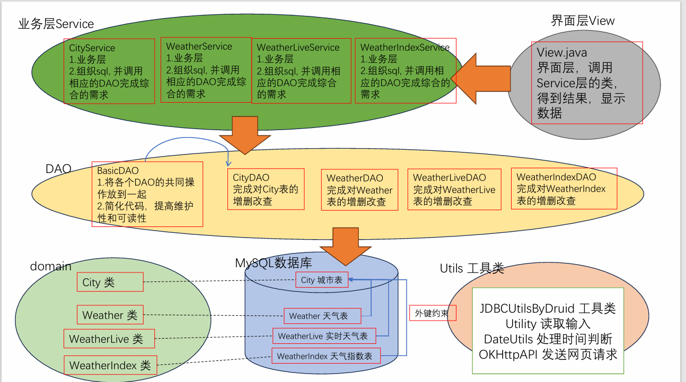

## 3. 功能实现

### 3.1 功能概览
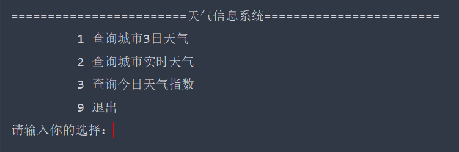
**特殊说明：支持查询的城市名仅包括([北京，上海，杭州，福州])**

如果需要支持其他城市名，需要在数据库中手动添加
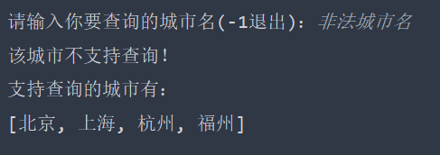

### 3.2 查询城市3日天气

### 3.3 查询城市实时天气
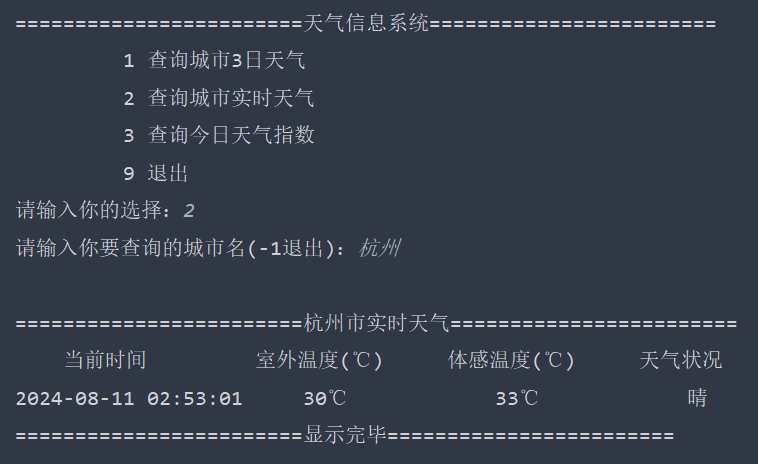

### 3.4 查询今日天气指数
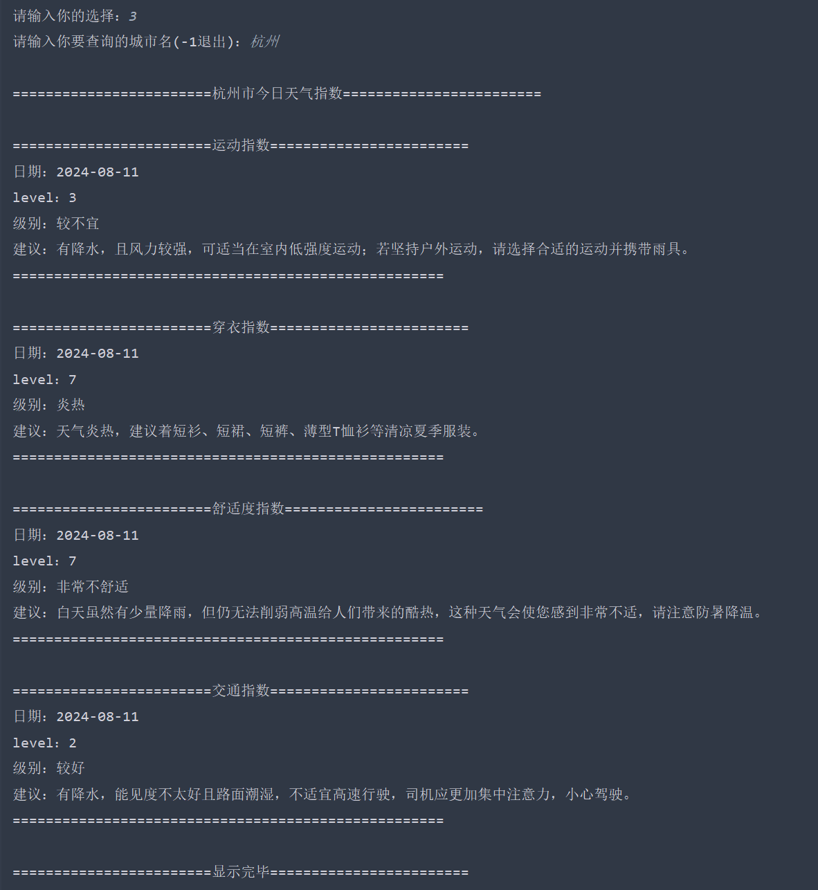

### 3.5 退出
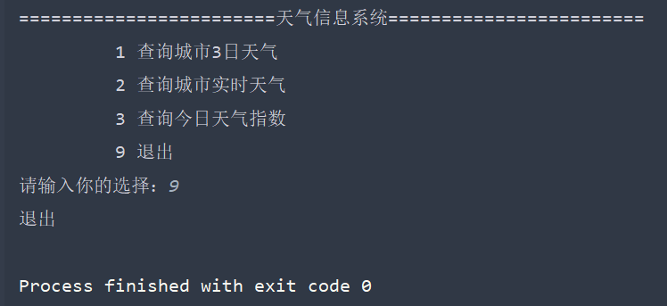

## 4. 实现细节

### 4.1 功能1：查询城市3日天气
实现细节：

为了防止用户对网站频繁请求导致超出规定免费请求次数，同时保证天气信息的**时效性**，设定查询**缓存时间(1h)**

细节如下：

* 如果查询时间处于缓存范围内(1h), 直接输出信息
* 如果是第一次查询或查询时间超出缓存时间(1h), 调用API查询信息，更新数据库，最后输出
* 特判：上一次更新时间位于23点-0点，此次查询时间为0点-1点，即判断更新时间和查询时间是否为同一天，那么即使位于缓存范围内，仍需更新数据库

### 4.2 功能2：查询城市实时天气
实现细节：

为了防止用户对网站频繁请求导致超出规定免费请求次数，同时保证天气信息的**时效性**，设定查询**缓存时间(10min)**

细节如下：

* 如果查询时间处于缓存范围内(10min), 直接输出信息
* 如果是第一次查询或查询时间超出缓存时间(10min), 调用API查询信息，更新数据库，最后输出

### 4.3 功能3：查询城市天气指数
实现细节：

为了防止用户对网站频繁请求导致超出规定免费请求次数，同时保证天气信息的**时效性**，设定查询**缓存时间(1h)**

细节如下：

* 如果查询时间处于缓存范围内(1h), 直接输出信息
* 如果是第一次查询或查询时间超出缓存时间(1h), 调用API查询信息，更新数据库，最后输出
* 特判：上一次更新时间位于23点-0点，此次查询时间为0点-1点，即判断更新时间和查询时间是否为同一天，那么即使位于缓存范围内，仍需更新数据库

### 4.4 和风天气API调用的异常处理
**问题引入**：在向网页发送请求后，返回的很有可能**不是**希望的数据，而是一串**错误代码**！

**问题解决**：根据和风官方提供的错误状态码，实现一个**异常类 ErrorStatusException**

错误状态码如下图所示：

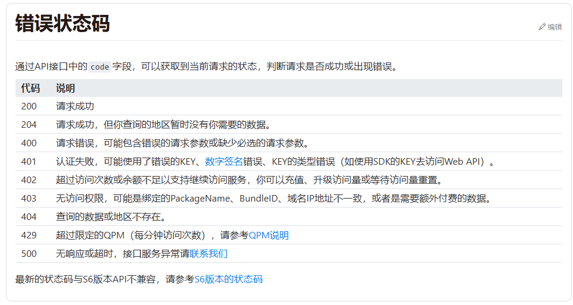

异常类ErrorStatusException实现细节：
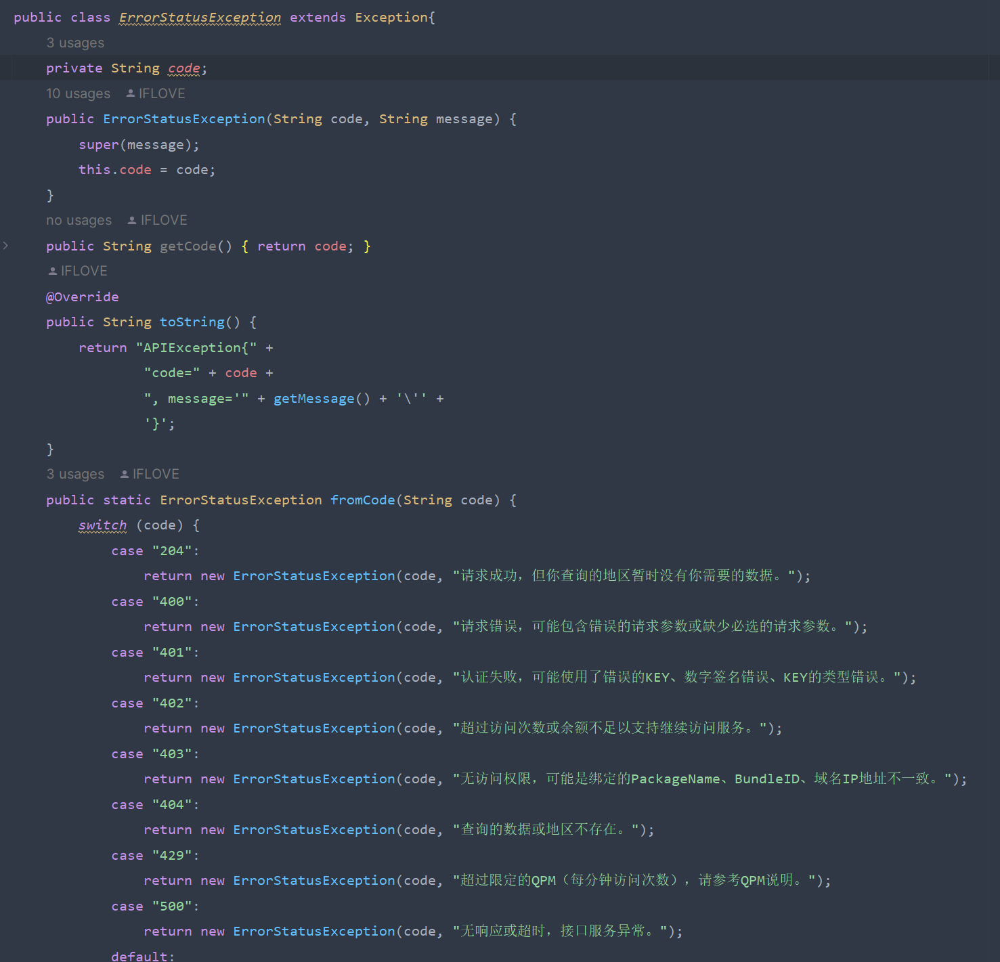

### 4.5 使用OKHttp实现和风API的调用
1): 创建 **工具类 OKHttpAPI**

2): 查阅 OKHttp 官方文档，实现发送 get 请求并接受返回值的方法
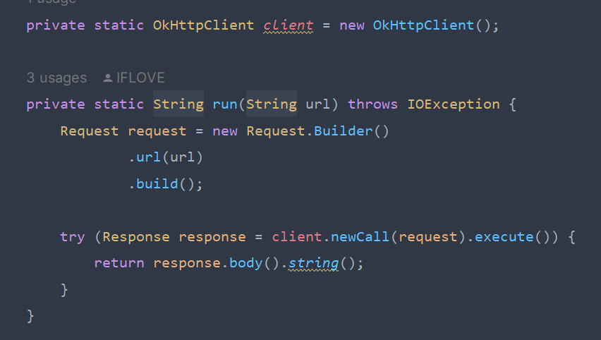

3): 调用 (2) 中的 run 方法，实现对应 3 个项目功能的静态方法

使用 阿里巴巴的 FastJson2 解析获得的 JSON 数据文件

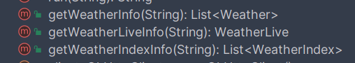

### 4.6 FastJson2 的使用细节
1): FastJson2 的使用非常简单！使用 **JSONObject.parseObject()** 方法将 run() 方法返回的 **String** 转换为一个 **JSON** 对象

2): 根据 JSONObject 的结构，直接 **get** 即可！

### 4.7 Java 日期时间处理细节

1): 仔细观察请求返回的 JSON 文件，注意到，返回的数据中的日期拥有**两种不同的格式**
1. **"yyyy-MM-ddThh:mm+08:00" 格式**： 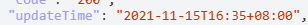
2. **"yyyy-MM-dd" 格式**：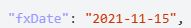

2): 将以上两种格式转换为 LocalDateTime 对象
1. **"yyyy-MM-ddThh:mm+08:00" 格式转换**：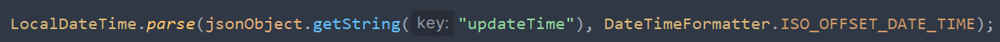
2. **"yyyy-MM-dd" 格式转换**：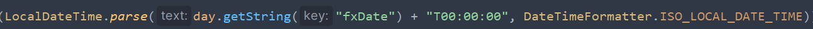

