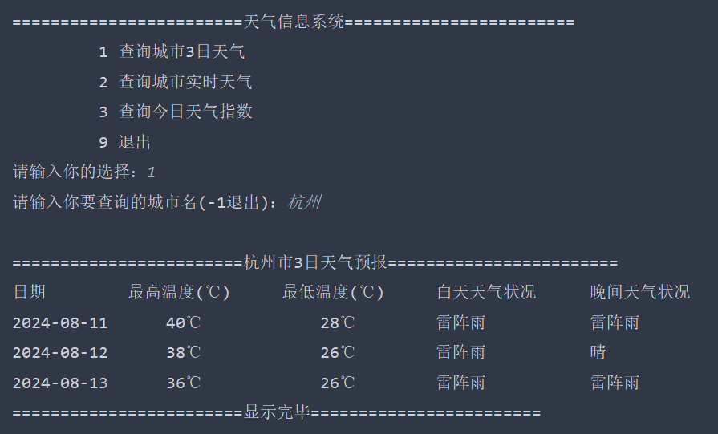

# 天气信息系统
## 1. 项目简介
实现了一个简单的天气信息系统。

通过调用和风天气提供的免费API完成任务：

使用的api:

    1. 城市查询 API，用于查询城市的 城市ID（id）、纬度（lat）、经度（lon）等城市信息

    https://geoapi.qweather.com/v2/city/lookup?key=这里填你的key&location=要查询的城市 名字

    2.三日天气查询 api ，用于查询某地今日、明日、后日的天气信息

    https://devapi.qweather.com/v7/weather/3d?key=这里填你的key&location=要查询的城市 的id

通过数据库记录以下信息，实现了对数据的增删改查：

    城市：城市id，城市名
    天气信息：id，城市id，更新时间，日期，最高温度，最低温度，白天天气状况，晚间天气状况
    实时天气信息：城市id，更新时间，观测时间，室外温度，体感温度，天气状况
    天气指数：城市id，更新时间，日期，类型，名称，等级，级别，建议

项目实现的功能有：
    
    1. 查询某座城市3日内天气预报
    2. 查询某座城市的实时天气信息
    3. 查询某座城市的今日天气指数

## 2. 整体框架分析

### 2.1 对于数据库：
构建 **城市表 City，天气表 Weather，实时天气表 WeatherLive，天气指数表 WeatherIndex**。

其中，天气表 Weather，实时天气表 WeatherLive，天气指数表 WeatherIndex 的 属性 CityId 受到 城市表 City 的属性 Id 的 外键约束。

### 2.2 对于程序编写：
需要用到 **javaSE基础，MySQL数据库，SQL语句编写，NaviCat可视化工具，JDBC框架，Java IO读写，Apache-DBUtils工具类，Druid数据库连接池，DAO对象创建，OKHttp框架调用，FastJson2框架调用，Lombok框架调用, Java时间处理方式**
等知识点。

### 2.3 项目整体框架分析：

## 3. 功能实现

### 3.1 功能概览

### 3.2 查询城市3日天气

### 3.3 查询城市实时天气

### 3.4 查询今日天气指数

### 3.5 退出

